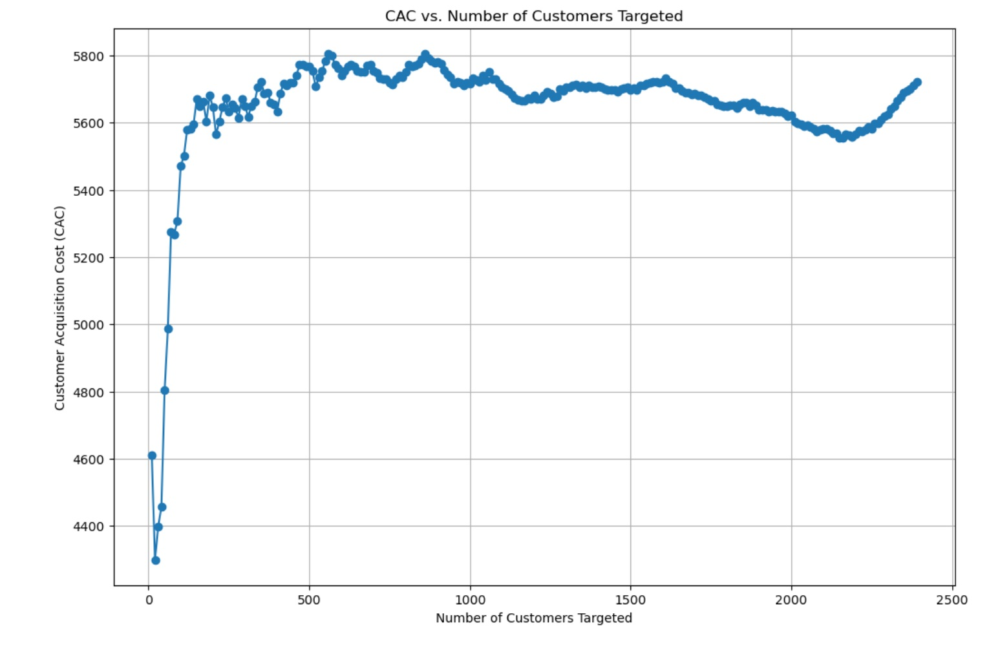

# Marketing CAC Optimization with Machine Learning

## Business Problem & Data

This project simulates the allocation of a $1M/month digital marketing budget using machine learning to optimize Customer Acquisition Cost (CAC).  
The goal is to maximize conversions and minimize CAC by targeting the most promising leads, based on real digital marketing campaign data.

- **Dataset:** [Digital Marketing Campaign Dataset](link-to-dataset-or-source)
- **Features:** Customer demographics, campaign channel/type, engagement metrics, previous purchases, loyalty points, and conversion outcome.

---

## Approach & Modeling

1. **Exploratory Data Analysis (EDA):**
   - Analyzed conversion rates, customer profiles, and campaign performance.
   - Visualized feature distributions and key drivers of conversion.

2. **Feature Engineering:**
   - Encoded categorical variables and prepared data for modeling.

3. **Modeling:**
   - Trained Logistic Regression, Random Forest, and XGBoost classifiers to predict conversion probability.
   - Used class weighting and evaluation metrics suitable for imbalanced data.
   - Selected the best model based on ROC-AUC and business explainability.

---

## Results: CAC & Plots

- **Baseline CAC (all prospects):** \$5,705.58
- **Optimized CAC with ML targeting:** \$5,632.01
- **Total conversions achieved (simulated):** 177 out of 188 targeted customers
- **Key Plots:**
  - CAC vs. Number of Customers Targeted
  - Conversion Rate vs. Number of Customers Targeted

---

## Key Business Insights

- Targeting only the highest-probability leads significantly reduces CAC and increases conversion efficiency.
- The most important predictors of conversion were previous purchases, campaign type, and customer engagement metrics.
- Efficiency curves demonstrate the value of focused targeting, as CAC rises and conversion rate falls when expanding to less qualified leads.

---

## Next Steps / Deployment

- **Productionization:**  
  - Modularize and automate data processing, scoring, and reporting.
  - Schedule model retraining and scoring on a weekly or monthly basis.
  - Integrate model outputs into dashboards or marketing workflows for real-time decision-making.

- **Improvements:**  
  - Experiment with advanced feedback loops and multi-channel optimization.
  - Deploy model as an API for live scoring.
 
